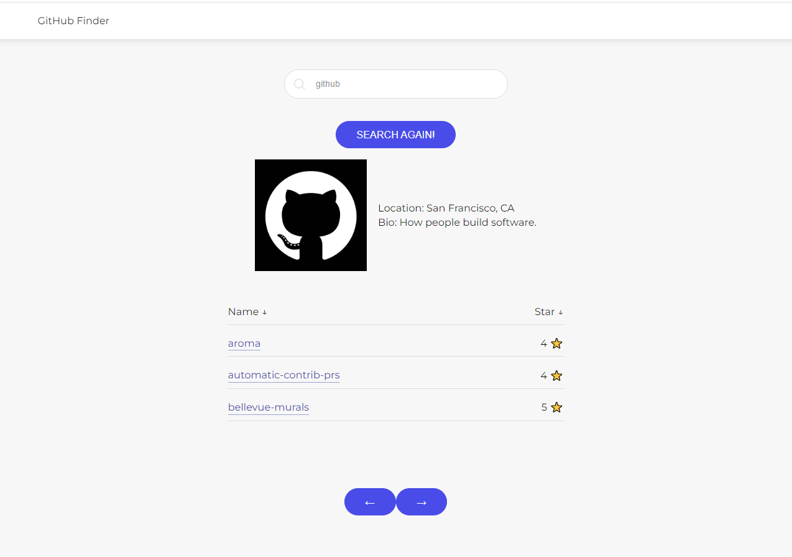

# GitHub Finder
## App writen on Vue 2, Vuex, Vue-router and load repos from GitHub API using axios
## Supports sorting and pagination repos



## Project setup
```
yarn install
```

### Compiles and hot-reloads for development
```
yarn serve
```

### Compiles and minifies for production
```
yarn build
```

### Customize configuration
See [Configuration Reference](https://cli.vuejs.org/config/).
